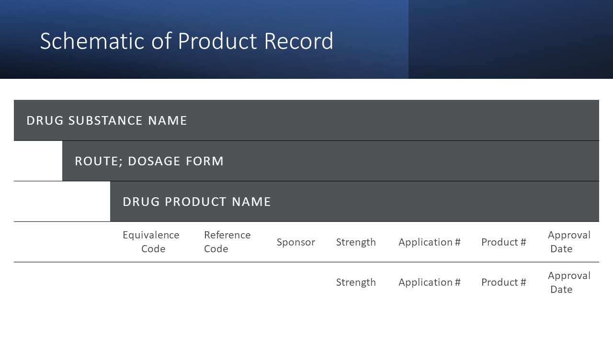

# DrugExtract

## Overview

My [thesis studying pharmaceutical competition](https://github.com/Marmuvar/GenRxPredict/blob/main/Benmuvhar-Classification%20of%20Generic%20Manufacturers%20and%20Competition%20in%20the%20Pharmaceutical%20Industry.pdf) relied upon data compiled from annual reports from the United States Food and Drug Administration.  The DrugExtract module describes the data sources and custom python code used to parse .pdf format files.  From these, individual line items are extracted from whitespace-delimited tables having irregular entries. Subsequent steps eliminate duplicates and perform limited data cleaning.

## Background

Pharmaceutical patents differentiate the innovative science behind brand drug manufacturing and the commodity products manufactured by generic drug companies.  Upon patent expiration, financial blockbuster status of a drug quickly erodes as generic products compete for market share.  For generic companies, accurate prediction of co-entrants can inform decisions about which products to develop in order to benefit from limited competition.  Therefore, I wanted to understand if a relationship existed between product patents, drug product characteristics, and timing of generic products entering the market.  For a specific overview of the background and analysis, see project [GenRxPredict](https://github.com/Marmuvar/GenRxPredict).  The project described here focuses on the data extraction challenges.  

Each year, the FDA publishes the commonly referenced ["Orange Book"](https://www.fda.gov/drugs/drug-approvals-and-databases/orange-book-data-files), an official record of all drug products approved for marketing in the United States. This book establishes which products are generic and substitutable for each innovative brand product.  It contains a record of all products discontinued from marketing.  Finally, it details which patents the brand products claim for each drug product.  These specific patents may form the basis for any infringement lawsuits brought against generic applicants in accordance with the Patent Term Restoration Act.  Details of the patents also include any regulatory exclusivity clauses that accompany each patent.  

These sections differ in format and content.  Common details in each section include the drug substance name, unique application number, and product code, which enumerates differing product strengths or other variations.  Together, these establish a unique key for correlating distinct records across sections.  A sample page from the drug product listing appears here:

The **Prescription Drug Product** section includes the following fields:

| Field | Description |
| --- | --- |
| **Route of Administration:** | Specific FDA term describing how the drug enters the body, such as "oral" (taken by mouth"), "intravenous" (injected to bloodstream), and similar demarcations |
| **Dosage Form:** | Subclass of drugs in administration route, such as liquids, tablets, and capsules administered orally |
| **Drug Product Name:** | Brand drug products typically use an invented commercial names such as the cholesterol drug, Lipitor, while generic products use the specific drug chemical name, such as acetaminophen, found in the pain treatmentd equivalent to Tylenol. |
| **Reference Designation:** | For each unique drug substance, route of administration, and dosage form, the FDA designates one or more products as a "reference product" to which generic products test equivalency.  A "reference standard" is designated if reference products are discontinued |
|**Therapeutic Equivalence Code:** | Where multiple product sources exist for a drug substance and route of administration, the FDA assigns a two letter equivalence code, such as "AB".  Generally, the first letter represents whether product substitutions are allowed ("A") or forbidden ("B"), while the second letter represents the route of administration.  A suffixed digit may differentiate similar products having different pharmacological characteristics. The FDA may also determine that a generic cannot be substituted for the brand. |
| **Sponsor Name:** | A product's sponsor is responsible for submission and maintenance of the application.  Due to changes in corporate identity due to merger or restructuring, the sponsor name may change across editions of the Orange Book. |
| **Approval Date:** | The approval date occurs when the FDA provides marketing authorization for a product after application review. |   

The **Discontinued Product** section duplicates entries of the prescription drug product list except that bioequivalence codes are unlisted.  Individual product codes and strengths under an application may be withdrawn from the market while others remain marketed.  The year of discontinuance is not reported and must be implied from the Orange Book edition in which the item first occurs.  

The section entitled Prescription and OTC Drug Product Patent and Exclusivity List enumerates the following details:

| Field | Description |
| --- | --- |
| **Patent Number and Expiration Date:** | For each application and product number (strength), the assigned patent number and patent expiration date are listed.  In rare cases, patent numbers may not apply to each strength in an application.  Multiple patents may be assigned to a single drug product. |
| **Patent Codes:** |  Codes describe if a patent pertains to the drug substance, the drug product (dosage form), or therapeutic usage area.  The usage code may be one of over 3000 four digit codes that correspond to a brief description of the clinical or treatment aspects claimed by a patent.  For example: "U-2627: Topical treatment of plaque psoriasis in patients 12 years and older."  Multiple usage codes may be assigned to a single patent. |
| **Exclusivity Codes and Expiration Date:**  | Exclusivity periods represent statutory prohibitions that prevent the FDA from approving generic products for a certain time period.  These arise from new molecule development, treatment of rare diseases, clinical studies in pediatric populations, and other reasons.  Exclusivity periods may run concurrently or in serial with patents.  Multiple exclusivity codes may be assigned to a single patent. |

## Data Sources  

While the FDA maintains an electronic Orange Book, the online version only captures data for the current year. Certain details are deprecated following periodic updates:  

*As patents expire, they are removed from the online listing. 
*As products are removed from the market, the equivalence relationship between branded and generic products is removed. 

To develop a comprehensive review of historical applications, it was necessary to perform data extraction from PDF renditions of the Orange Book. Historical editions were made available online via [The FDA Law Blog](https://www.thefdalawblog.com/orange-book-archives/) following a Freedom of Information Act request to the FDA for electronic copies.  Due to scan illegibility, data could not be extracted prior to the 25th edition.  However, an archival project at [Drug Database](http://drugdatabase.info/fda-orange-book-patents/) captured key elements of the patent history.  Researchers for this database had also encountered legibility challenges and had performed manual data entry.  In turn, a portion of these entries were verified against the Orange Book and considered as acceptable supplements for the extracted patent information. 

## Data Acquisition  

Data extraction and limited cleaning was first performed using custom Python applications. Separate applications were written to parse product labels, active product records, discontinued product records, and patent information.  These applications implemented standard libraries including numpy, pandas, os, and re.  Other packages are discussed in the descriptions of each application.  

The Orange Book files presented numerous challenges in format and content.  For each section, data groups reflected a heirarchical structure based on labeled headers.  Considering the Pharmaceutical Product section, each group of drug substance, route of administration, and drug product headers were followed by line item details for relevant applications grouped by sponsor.  Columns were maintained using consistent white space between entries.  For each different strength, sponsor and header information were not repeated.  Further complicating this, sponsor names and product strengths could require multiple lines, resulting in extraneous white space.  Last, the spacing of columns between Orange Book editions varied.   Because the contents and size of each grouping varied, each page was unique.  Therefore, data extraction required tables to be parsed row-wise.

A custom application using tabula and pypdf2 was designed.  The tabula provides a flexible tool for extracting PDF data from a defined table or field format.  Although the variable field size prevented full use of the package, it provided a valuable tool for converting column and row based data into a dataframe.  Similarly, pypdf2 provides basic tools for identifying and extracting pages.  The extraction process is described here for the drug product section.  However, the algorithm with limited modifications is applicable to the discontinued product and patents sections.   

Column spacing for each .pdf file was manually determined and predefined in the algorithm.  For each pdf file, page header information demarcated the start and ending pages for the Pharmaceutical Product section.  Within this range, individual rows containing data fields were evaluated as either a header or body element.  If a line contained heading elements (drug substance, route of administration or drug product name), it was added to a temporary storage list. 

Body elements were stored as a separate list once header details were absent from a line.  Multi-line sponsor or strength entries were evidenced by missing header and body details in the line.  If the following line contained partial sponsor or strength entries, the contents were appended to relevant fields.  If not, the entry was appended to the header information, and the temporary list was added to the master data frame.  If the following line contained new header details, the temporary line was further updated with new product details.  The process continued iteratively until the last line was reached.  

## Data Cleaning and Preprocessing  

Additional steps for cleaning, consistency, and consolidation were performed on data extracted from the Orange Book.  Cleaning steps ensured similar punctuation used for separators and eliminated excess whitespace or footnotes from fields.  Also, legal entity designations "CORP", "CO", "INC", "LTD", "LLC", and "GLOBAL" were removed from sponsor names.  While these terms may reflect changes in underlying operating principles or business units in a company, it was decided that the bias caused by eliminating these designations was offset by database simplification.

Consistency steps addressed FDA's gradual standardization of dosage form descriptions, administrative updates, and changes in company names.  Due to a wide range of administrative routes listed for injectable, intravenous, and oral products, a number of low frequency categories were reduced to more general classifications.  Similar condensation of oral dosage form routes were made.  Last, consolidation steps eliminated duplicate entries after standardization across multiple editions.  

Changes in entries occurring across editions are described in the following table.   

<!--ts-->

| Constraint | Rationale |  
| --- | --- |
| Distinct products are defined by the application number and route of administration. | Establishes a consistent drug product identification |
| Duplicated entries based on application number, product number, and drug substance are limited to the first occurrence | Eliminates redundancy of the data file while recognizing status quo at time of application submission. |
| Where multiple strengths are issued to an application on multiple dates, only the earliest date will be considered| The thesis considers only the primary activities required for the initial drug approval. Adding a drug strength to an application often relies on significant existing research. Further, they are less likely to be impacted by patents due to elapsed time for patent expiry. |
| Where the sponsor’s name changes due to a company action, the original name of the applicant will be retained. | The thesis considers only the corporate identity at the time of approval. The impact of consolidation or divestiture is unknown |
| For predictive models, only products for which the original branded product remains marketed will be considered. | This ensures formulation information is available based on the removal of discontinued products from the label database. |
| For predictive models, where multiple reference products are available, the product with the earliest approval date will be used as a reference. | This ensures a consistent starting point to determine opportunities for generic entry. |

<!--te-->

## Additional Work

* This module supplements product ingredient listings and packaging information parsed from .xml renditions of the product labels.  

* Separate code in R consolidates the parsed data with patent data listed from Drug Database.  

* Other cleaning steps were performed in R based on data analysis directives.  

## Outcomes
The extraction modules parsed and consolidated Orange Book entries as follows:  

| - | Marketed Products | Discontinued Products | Patents |  
| --- | --- |  --- | --- |
| Line Items | 285407 | 222169 | 182713 |  
| Unique Products, Manufacturers, and Strengths | 71321 | 53339 | 76366 |  
| Unique Products and Manufacturers | 32510 | 20940 | 2628 |  
| Unique Patents | NA | NA | 40165 |  

## Code and Operation

[Codebase for project](/Code)

| Jupyter Notebook Name (without version) | Description |  
| --- | --- |
| pdf_read_product /n pdf_read_patent /n pdf_read_discnt | Parse Orange Book reports for individual sections | 
| modify_prod_csv | Clean field names and spacing in product files |
| thesis_filter_prods /n thesis_filter_dnc /n thesis_filter_pats | Consolidate and standardize entries from multiple volumes |

### Directory Structure  

The directory structure was not optimized during project development and requires some manual file movement.

.pdf versions of the FDA Orange Book saved under subdirectory:  
OrangeBook/Testing 

Output .csv files written to:
OrangeBook/Testing/csv

Parsed .csv files should be placed under subdirectories:
OrangeData/Prods
OrangeData/dcn
OrangeData/Pats

Consolidated .csv files are written to:
OrangeData/for_analysis
